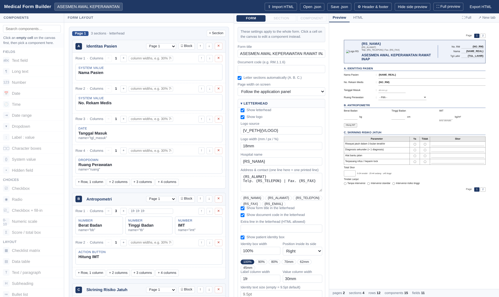
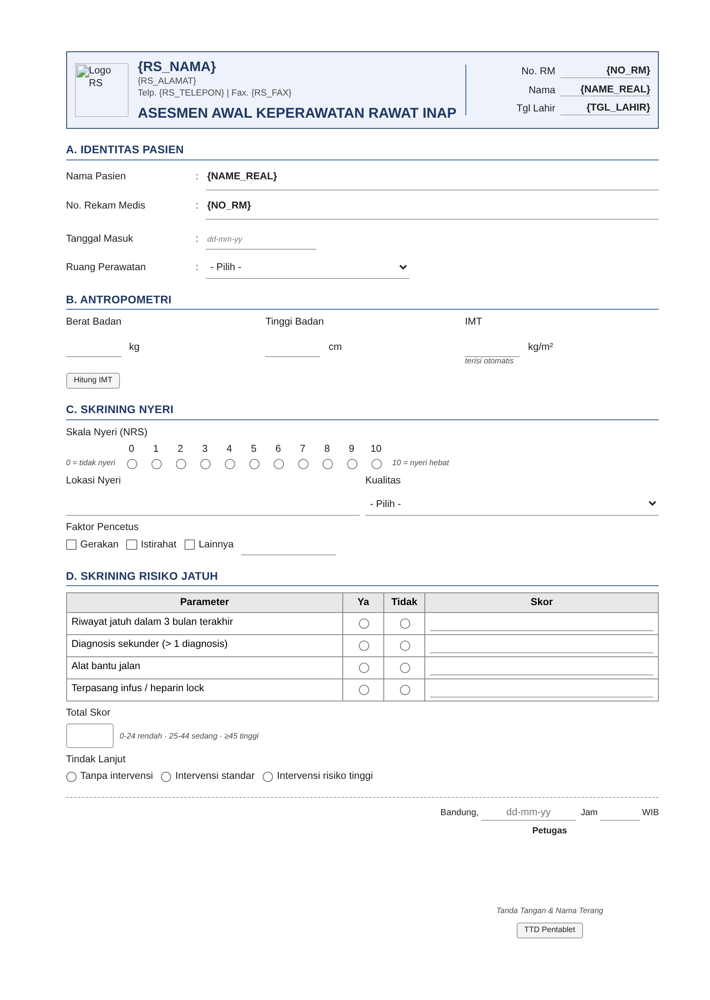
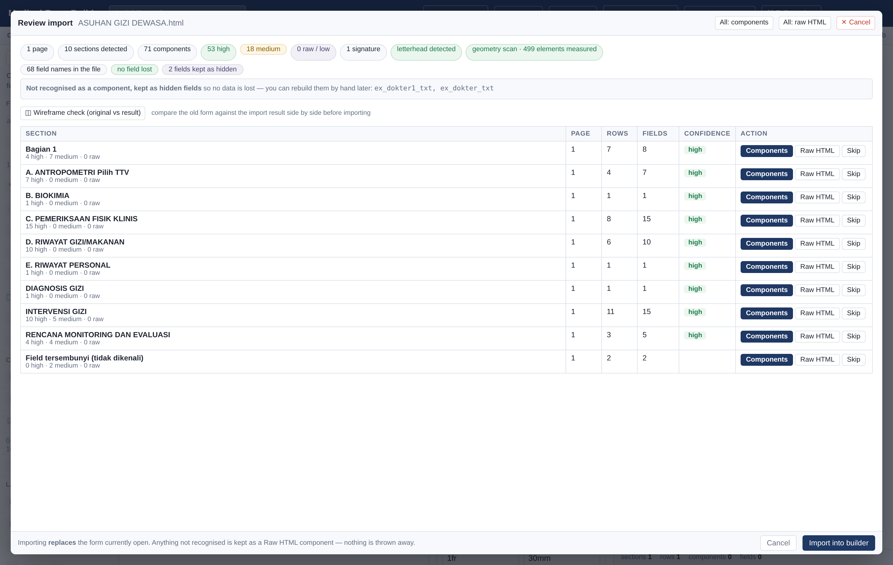
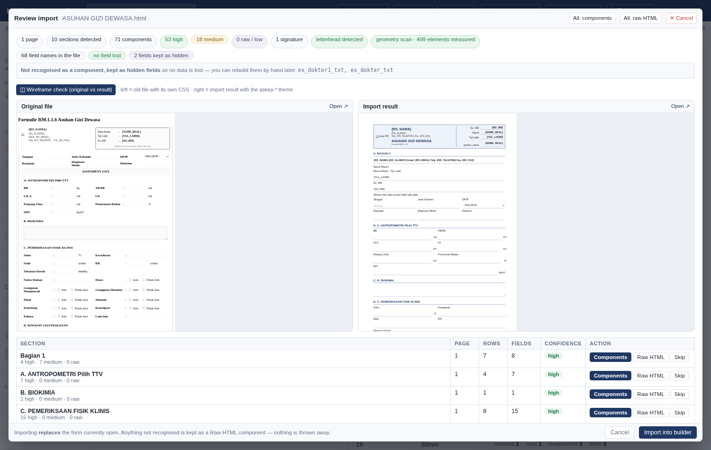
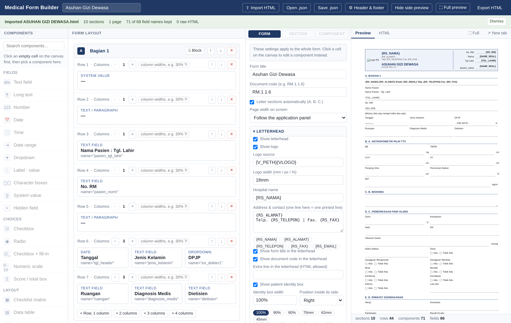
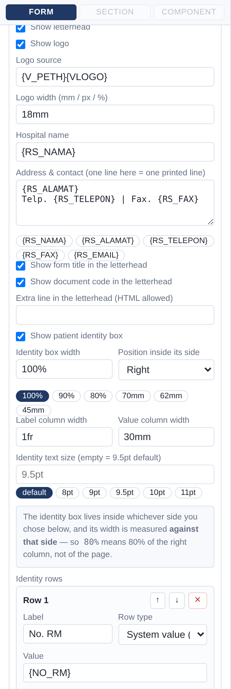
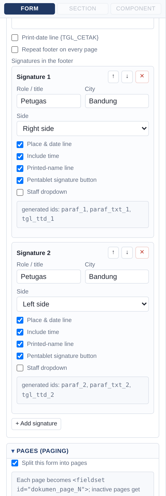
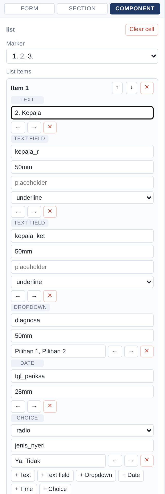
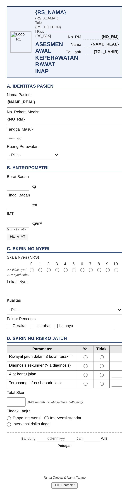
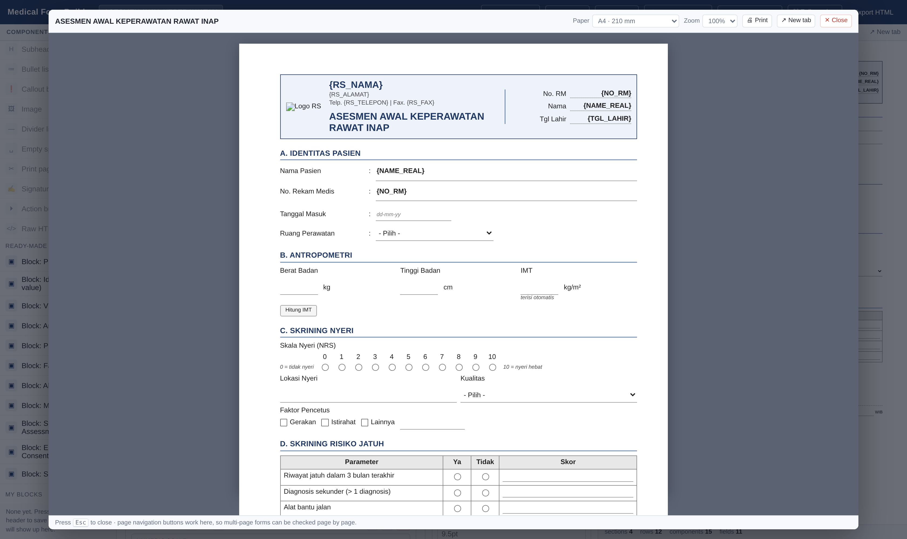

<div align="center">

# Medical Form Builder

**Menyusun formulir medis baru dari komponen standar — hasilnya langsung mengikuti wireframe UI rumah sakit.**

[](https://react.dev/)
[](https://vitejs.dev/)
[](https://nodejs.org/)
[](#keamanan-data)
[](#)
[](#impor-formulir-html-lama)
[](#)
[](#responsif--pratinjau)

</div>

---

Alih-alih menebak-nebak struktur formulir lama, builder ini menyusun formulir
**dari nol** memakai komponen yang sudah sesuai standar. Setiap komponen
menghasilkan markup `askep-*` yang benar, sehingga tipografi, jarak, dan
tampilan cetak otomatis mengikuti panduan **[A]–[G]**.

> [!NOTE]
> **Antarmuka builder berbahasa Inggris**; isi formulir yang dihasilkan tetap
> bahasa Indonesia (label bawaan, blok siap pakai, teks cetak). Dokumentasi ini
> juga bahasa Indonesia.

<div align="center">
  
</div>

## Daftar isi

- [Persyaratan](#persyaratan)
- [Menjalankan](#menjalankan)
- [Alur kerja](#alur-kerja)
- [Komponen](#komponen)
- [Impor formulir HTML lama](#impor-formulir-html-lama)
- [Halaman bertingkat (paging)](#halaman-bertingkat-paging)
- [Kop & footer](#kop--footer)
- [Ukuran, lebar kolom, dan tata letak label](#ukuran-lebar-kolom-dan-tata-letak-label)
- [Blok siap pakai](#blok-siap-pakai)
- [Blok buatan sendiri](#blok-buatan-sendiri)
- [Responsif & pratinjau](#responsif--pratinjau)
- [Berkas definisi (.json)](#berkas-definisi-json)
- [Atribut khusus aplikasi](#atribut-khusus-aplikasi)
- [Struktur proyek](#struktur-proyek)
- [Keamanan data](#keamanan-data)
- [Hubungan dengan Medical Form Formatter](#hubungan-dengan-medical-form-formatter)

---

## Persyaratan

| Kebutuhan | Keterangan |
|---|---|
| Node.js | 18 atau lebih baru (untuk mengembangkan / membangun ulang) |
| Browser | Chrome, Edge, atau Firefox versi terkini |
| Koneksi internet | Hanya saat `npm install` pertama kali |

> [!TIP]
> Folder **`dist/`** berisi hasil build yang sudah jadi. Kalau hanya ingin
> **memakai** builder tanpa memasang Node.js, cukup buka `dist/index.html`
> langsung di browser.

## Menjalankan

```bash
npm install      # sekali saja
npm run dev      # mode pengembangan, http://localhost:5173
npm run build    # membangun ulang folder dist/
npm run preview  # menjalankan hasil build
```

---

## Alur kerja

1. **Isi judul formulir** di bilah atas.
2. **Buat section** — tiap section otomatis diberi huruf `A.`, `B.`, `C.`
   (bisa dimatikan di Pengaturan).
3. **Tambah baris**, lalu tentukan **jumlah kolomnya** (1–4).
4. **Klik sel kosong**, lalu pilih komponen dari palet kiri.
5. **Atur propertinya** di panel kanan: label, nama field, wajib diisi, satuan,
   opsi, dan seterusnya.
6. **Pratinjau** di panel paling kanan memperbarui diri seketika. Tab **HTML**
   menampilkan kode yang akan dihasilkan.
7. **Ekspor HTML** untuk ditempel ke aplikasi, atau **Simpan .json** supaya
   formulirnya bisa dibuka dan diubah lagi nanti.

Bilah statistik di bawah pratinjau menghitung section, baris, komponen, dan
field — sekaligus memperingatkan bila ada **nama field yang ganda**.

<div align="center">
  
  <br><sub>Hasil ekspor dari empat blok siap pakai — kop, pola <code>Label : isian</code>,
  skala nyeri 0–10, matriks skor, kotak total, dan footer tanda tangan.</sub>
</div>

---

## Komponen

29 komponen, dikelompokkan tiga. Kotak pencarian di atas palet menyaring
daftarnya saat diketik.

| Kelompok | Komponen |
|---|---|
| **Isian** (*Fields*) | Isian teks · Isian panjang · Isian angka · Tanggal · Jam · Rentang tanggal · Dropdown · Label : isian · Kotak per karakter · Nilai sistem · Field tersembunyi |
| **Pilihan** (*Choices*) | Checkbox · Radio · Ceklis + isian · Skala angka · Kotak skor / total |
| **Struktur** (*Layout*) | Matriks ceklis · Tabel data · Teks/paragraf · Sub-judul · Daftar poin · Kotak catatan · Gambar · Garis pemisah · Jarak kosong · Pemisah halaman · Tanda tangan · Tombol aksi · HTML bebas |

Beberapa yang perlu disorot:

- **Matriks ceklis** — pola paling sering dipakai formulir asesmen: daftar item
  × kolom pilihan (`Ya` / `Tidak`) plus kolom keterangan. Jumlah kolom pilihan
  dan daftar itemnya bebas ditambah-kurangi.
- **Tabel data** — kolom bebas ditentukan (judul, `name`, lebar), jumlah baris
  bisa diatur, dan opsional diberi tombol *tambah baris*.
- **Ceklis + isian** — pola `☐ Nyeri, lokasi ______` : tiap opsi boleh punya
  isian garis sendiri di belakangnya.
- **Skala angka** — skala nyeri 0–10 (atau rentang lain) sebagai radio berderet
  dengan keterangan ujung kiri dan kanan.
- **Kotak skor / total** — kotak kecil untuk hasil penjumlahan, lengkap dengan
  keterangan penilaian; bisa dijadikan *hanya baca* agar diisi skrip aplikasi.
- **Kotak per karakter** — deret kotak 7 mm untuk No. RM / NIK.
- **Pemisah halaman** — memaksa isi berikutnya mulai di halaman baru saat
  dicetak; di layar tampak sebagai garis putus-putus.
- **Tombol aksi** — `<a class="askep-btn" id="…">` yang hanya tampil di layar,
  untuk disambungkan ke skrip aplikasi (mis. *Hitung IMT*).
- **HTML bebas** — pintu darurat untuk kasus yang tidak tercakup komponen lain.

---

## Impor formulir HTML lama

Tombol **⇪ Import HTML** di bilah atas memindai formulir lama, lalu menyusunnya
ulang memakai komponen builder — hasilnya **bisa langsung diedit di kanvas**,
bukan sekadar dirapikan tampilannya.

<div align="center">
  
</div>

### Alurnya

```
Import HTML → render & ukur di iframe tersembunyi → pindai → layar tinjauan
           → pilih per section → masuk kanvas
```

1. Pilih berkas `.html` — seluruh proses berjalan **di peramban**, tidak ada
   berkas yang dikirim ke mana pun.
2. Layar tinjauan menampilkan setiap section yang terdeteksi beserta
   **tingkat keyakinan** dan laporan mutu.
3. Tiap section bisa diatur: **Components** (jadi komponen builder),
   **Raw HTML** (markup asli dipertahankan utuh), atau **Skip**.
4. Tekan **Import into builder** — formulir yang sedang terbuka **diganti**.

### Pemindaian wireframe (geometry scan)

Markup lama tidak menggambarkan tata letak: tabel dipakai untuk komposisi,
`display:flex` untuk isian, tabel bersarang sampai 4–5 tingkat. Karena itu
pemindaian tidak berhenti di markup — formulir lama **dirender di iframe
tersembunyi** (CSS asli ikut, skrip tetap dibuang), lalu posisi setiap elemen
diukur memakai `getBoundingClientRect()`:

- elemen-elemen yang saling tumpang tindih secara vertikal dikelompokkan
  menjadi **baris visual**, lalu diurutkan mendatar — jadi pola flex seperti
  `BB : ___ kg` terbaca sebagai *label + isian + satuan*;
- sel berisi banyak kontrol campuran (input + select, dua input beda nama,
  checkbox + isian) dipecah mengikuti baris visualnya, bukan langsung
  dijadikan Raw HTML;
- **lebar kolom** setiap baris dihitung dari ukuran nyata elemen — proporsi
  hasil impor mengikuti wireframe asli;
- judul section yang ditebalkan/diperbesar **lewat CSS** (bukan `<b>`) ikut
  terdeteksi dari *computed style*;
- kop bergaya ekspor tema sendiri (`askep-kop`, `askep-judul`, `askep-grid`)
  dikenali dan dipetakan balik ke fitur builder.

> [!NOTE]
> CSS lama hanya hidup di iframe ukur — **tidak pernah ikut ke hasil**.
> Hasil impor selalu ditulis ulang memakai tema `askep-*` (token terpusat).
> Bila iframe tidak bisa dirender, pemindai otomatis kembali ke heuristik
> markup; laporan mutu menandainya dengan badge
> *geometry unavailable — markup heuristics only*.

### Wireframe check

Sebelum mengimpor, tekan **◫ Wireframe check** di layar tinjauan: formulir
**asli** (dengan CSS lamanya) dan **hasil impor** (tema `askep-*`) ditampilkan
berdampingan dalam skala A4 — kesesuaian hasil dengan wireframe asli bisa
dilihat mata sebelum masuk kanvas. Setiap sisi punya tautan **Open ↗** untuk
melihat ukuran penuh.

<div align="center">
  
</div>

### Yang dikenali

| Ditemukan di berkas lama | Menjadi |
|---|---|
| `input[type=text]`, `textarea`, `select` | Text field · Long text · Dropdown |
| `class="datepickerBoots"` | Date |
| Grup checkbox/radio ber-`name` sama (walau terpisah beberapa sel) | Checkbox / Radio + seluruh opsinya |
| Tabel ber-`thead` dengan isian berulang | Data table (judul kolom, `name`, jumlah baris) |
| Tabel `item × Ya/Tidak/Keterangan` | Checklist matrix (termasuk nama kolom keterangan aslinya) |
| Logo + `{RS_NAMA}` + kotak identitas | Pengaturan **Letterhead**; isian di dalam kop jadi baris identitas bertipe isian |
| `paraf_N`, `CreateTTD`, `image_paraf_N` | Tanda tangan footer |
| `fieldset id="dokumen_page_N"` | **Paging** dinyalakan, section dibagi per halaman |
| Baris tebal / `I.` `A.` selebar tabel / ditebalkan via CSS | Judul section |
| Baris flex `BB : ___ kg` (diukur dari posisi) | Text field berlabel + satuan |
| Deretan baris bertanda `- Obat [__]` / `a. Nadi` / `2. Kepala ( ) …` (termasuk yang satu tabel per butir) | **Bullet list ber-isian** — penanda jadi marker list, isian/pilihan jadi segmen |
| Sel "kalimat isian" (`Hb: ___ , Leukosit: ___ …`) | Satu butir list ber-isian |
| Blok kunci–nilai (`askep-kv`, teks + isian sejajar) | Baris field berlabel per pasangan |
| Grid / opsi hasil ekspor tema sendiri | Baris & komponen builder, lebar mengikuti ukuran asli |
| Sisanya | Komponen **Raw HTML** (utuh) |

Pola `<td>Nama</td><td>:</td><td><input></td>` dikenali sebagai satu field
berlabel, dan satuan (`kg`, `mmHg`, `x/menit`) di belakang isian ikut terbaca.

### Jaminan: tidak ada field yang hilang

Setiap `name` di berkas asli dilacak. Yang tidak menjadi komponen akan
disimpan sebagai **field tersembunyi**, sehingga daftar `name` tetap utuh.
Laporan mutu menampilkannya secara terbuka:

```
4 pages · 15 sections · 146 components · 101 high · 26 medium · 19 raw
219 field names in the file · no field lost · 5 fields kept as hidden
10 duplicate ids in the source
```

Hasil pengujian pada lima formulir asli rumah sakit + satu contoh
(sebelum → sesudah geometry scan; *raw* = bagian yang tetap menjadi
Raw HTML):

| Formulir | Section | Halaman | Nama field | Hilang | Raw |
|---|---|---|---|---|---|
| ASESMEN AWAL KAMAR BERSALIN | 15 | 4 | 219 | **0** | 19 → **11** |
| ASSESMEN PASIEN TERMINAL | 5 | 1 | 131 | **0** | 7 → **0** |
| ASSESMENT AWAL KEPERAWATAN ANAK RJ (pola list bertanda) | 6 | 2 | 70 | **0** | **0** |
| ASUHAN GIZI DEWASA (45 `display:flex`) | 10 | 1 | 68 | **0** | 2 → **0** |
| CATHLAB (hasil ekspor tema `askep-*`) | 12 | 1 | 121 | **0** | 14 → **3** |
| CARA PEMBAYARAN RAWAT JALAN | 2 | 1 | 10 | **0** | 1 → **0** |
| SAMPLE INPATIENT ASSESSMENT | 4 | 1 | 19 | **0** | 4 → **1** |

Dengan geometry scan, jumlah field yang dikenali sebagai komponen nyata juga
naik drastis — misalnya KAMAR BERSALIN dari 94 menjadi **165 field**, dan
CATHLAB dari 12 menjadi **104 field**.

> [!IMPORTANT]
> **`<script>` dibuang total** — fungsi lama seperti `SetCHK()` atau `NextPage()`
> tidak ikut diimpor. Builder membuat sendiri skrip navigasi halaman bila paging
> dinyalakan.

> [!NOTE]
> **Id ganda tidak pernah diganti nama**, hanya dilaporkan — banyak formulir lama
> memang memuat id ganda (`check21`, `CreateTTD`) dan skrip aplikasi
> mengandalkannya.

<div align="center">
  
</div>

---

## Halaman bertingkat (paging)

Formulir panjang bisa dibagi menjadi beberapa halaman — **persis memakai pola
yang sudah dipakai aplikasi rumah sakit**:

```html
<ul class="pagination">
  <li class="active" myid="li_page_1"><a href="javascript:NextPage(1);">1</a></li>
  <li myid="li_page_2"><a href="javascript:NextPage(2);">2</a></li>
</ul>

<form class="smart-form" data-ttd="yes">
  <fieldset id="dokumen_page_1" class="askep-page-part">…</fieldset>
  <fieldset id="dokumen_page_2" class="askep-page-part hidden">…</fieldset>
</form>
```

Cara memakainya:

1. **Form settings → Pages (paging) → Split this form into pages.**
2. Kanvas berubah menjadi kelompok **Page 1**, **Page 2**, … Tombol
   **+ Add page** menambah halaman baru.
3. Tiap kepala section punya pemilih halaman — memindahkan section cukup dengan
   memilih nomor halamannya.

| Pengaturan | Guna |
|---|---|
| Navigation label / switch function | teks `Page` dan nama fungsi (`NextPage`) |
| Fieldset id prefix / hidden class | `dokumen_page_` dan `hidden`, ikut aplikasi Anda |
| Navigation above / below the form | navigasi ditaruh di atas, di bawah, atau keduanya |
| Include the page-switch script | menyisipkan `NextPage()` versi ringkas tanpa jQuery |
| Print all pages | mencetak seluruh halaman, bukan hanya yang sedang tampil |
| Repeat letterhead / footer on every page | kop & tanda tangan diulang atau tidak |

> [!IMPORTANT]
> Skrip yang disisipkan dibungkus `if (typeof window.NextPage !== "function")`,
> jadi kalau aplikasi Anda **sudah** punya `NextPage()` sendiri, fungsi bawaan
> aplikasi itulah yang dipakai. Bawaan: kop hanya di halaman pertama, tanda
> tangan hanya di halaman terakhir — sama seperti contoh formulir Anda.

Huruf section (`A.`, `B.`, `C.`) dihitung menurut urutan cetak lintas halaman,
jadi angka di kanvas selalu sama dengan hasil ekspor.

---

## Kop & footer

Kop dan footer **bukan lagi bagian yang saklek** — semuanya diatur dari panel
kanan, tab **Form**.

### Cara membukanya

Panel kanan punya tiga tab: **Form · Section · Component**. Tab **Form** berisi
pengaturan seluruh formulir, termasuk kop dan footer.

| Cara | Langkah |
|---|---|
| Paling cepat | tekan tombol **⚙ Header & footer** di bilah atas — panel langsung terbuka dan menggulir ke bagian kop |
| Lewat tab | klik tab **Form** di kepala panel kanan |
| Lewat kanvas | klik area kosong (latar abu-abu) di kanvas |

> [!TIP]
> Panel kanan berganti isi mengikuti apa yang sedang dipilih: mengklik section
> membuka tab **Section**, mengklik sel membuka tab **Component**. Tab **Form**
> selalu bisa diklik untuk kembali ke pengaturan kop, footer, dan halaman.

### Mengedit kop

<div align="center">
  
</div>

1. Buka tab **Form → Letterhead**.
2. Centang/lepas **Show letterhead** untuk menampilkan atau menyembunyikan kop.
3. Isi **Hospital name** dan **Address & contact** — satu baris di kotak itu =
   satu baris tercetak. Chip `{RS_NAMA}`, `{RS_ALAMAT}`, `{RS_TELEPON}` di
   bawahnya tinggal diklik untuk menyisipkan placeholder.
4. **Show logo** + **Logo source** mengatur logo (`{V_PETH}{VLOGO}` atau URL).
5. **Identity rows** adalah isi kotak identitas pasien. Tiap baris punya kartu
   sendiri: **label bebas diketik**, dan **jenis isiannya dipilih** — lihat tabel
   di bawah. Urutkan dengan ↑ ↓, hapus dengan ✕, tambah dengan
   **+ Add identity row** (atau chip placeholder untuk baris nilai sistem).
6. **Logo width** mengatur besar logo (`18mm`, `60px`, `12%`).

#### Label & isian tiap baris identitas

Baris identitas bukan cuma teks mati — tiap baris bisa dijadikan **isian
sungguhan** yang tersimpan ke aplikasi:

| Row type | Yang dihasilkan |
|---|---|
| **System value (text)** | teks dari aplikasi, mis. `{NO_RM}`, `{NAME_REAL}` (bawaan) |
| **Text input** | `<input type="text">` dengan `name` sendiri — bisa diketik petugas |
| **Date input** | isian tanggal lengkap dengan class `datepickerBoots` |
| **Empty line (write by hand)** | garis kosong untuk ditulis tangan setelah dicetak |
| **Choices (radio)** | deret pilihan, mis. `Kelas : I / II / III`; centang *Allow multiple choices* untuk checkbox (`name[]`) |

Setiap baris juga punya:

- **Label** — teks di kolom kiri, bebas diketik.
- **Field name** — atribut `name`/`id` untuk jenis input, tanggal, dan pilihan.
  Nama ini ikut dihitung pada bilah statistik dan pada peringatan **nama ganda**.
- **Value width for this row** — panjang isian **khusus baris itu**: `100%`,
  `60%`, `45mm`, `120px`, atau dikosongkan agar mengikuti kolom nilai.
  Diukur terhadap **kotak identitas**, bukan terhadap kolom nilai — jadi
  `100%` benar-benar selebar kotak dan labelnya naik ke barisnya sendiri.
  Nilai yang lebih lebar daripada kotak dibatasi otomatis, tidak pernah
  meluber keluar kop. Garis bawahnya ikut memanjang/memendek, dan isian tetap
  rapat ke tepi kanan.
- **Full width** — label ditaruh di atas, isian memakai lebar penuh kotak.

Semua isian di kop otomatis mendapat atribut aplikasi (`myid="check_cara"`),
sama seperti field di badan formulir.

> [!NOTE]
> Label panjang seperti *"Tanda tangan penerima"* akan **membungkus**, bukan
> melebarkan kotak — kotak identitas tidak akan meluber keluar kop.

#### Ukuran kotak identitas pasien

Kotak identitas **ikut sisi mana pun yang Anda pilih**, dan ukurannya sendiri
tetap bisa diatur — lebarnya dihitung **terhadap sisi itu**, bukan terhadap
halaman:

| Pengaturan | Isi |
|---|---|
| **Identity box width** | `100%`, `80%`, `62mm`, `45mm` — chip cepat tersedia |
| **Position inside its side** | rata kiri, tengah, atau kanan di dalam sisinya |
| **Label column width** | lebar kolom label (`1fr`, `40%`, `24mm`) |
| **Value column width** | lebar kolom nilai untuk **semua** baris (`30mm`, `34mm`, `45%`) — bisa ditimpa per baris lewat *Value width for this row* |
| **Identity text size** | kosong = 9,5 pt baku; bisa `8pt`, `9pt`, `10pt`, `11pt` |

Contoh: sisi kanan `40%` + **Identity box width** `80%` menghasilkan kotak
identitas selebar 32 % halaman, rata kanan, dengan kolom nilai 34 mm.

#### Membagi kop menjadi dua sisi

Bagian **Two-sided layout** di dalam grup *Letterhead*:

| Pengaturan | Isi |
|---|---|
| **Split the letterhead into a left and a right side** | matikan untuk membuat kop **satu kolom** (semua isi menumpuk selebar halaman) |
| **Left side width** / **Right side width** | bebas: `1fr`, `62mm`, `50%`, `240px`. Chip cepat: `1fr / 62mm`, `50% / 50%`, `60% / 40%`, `2fr / 1fr` |
| **Left / Right side alignment** | rata kiri, tengah, atau kanan untuk tiap sisi |
| **Divider line between the two sides** | garis tipis pemisah |
| **Which side each block sits on** | tiap blok — **Logo**, **Hospital name & address**, **Form title & document code**, **Patient identity box** — dipilih mau di kiri atau di kanan |

Jadi susunannya bebas dibalik: logo + identitas RS di kiri dan judul + kotak
pasien di kanan (bawaan), atau kotak pasien di kiri, judul di tengah-kanan,
logo sendirian di kanan — apa pun yang diminta format rumah sakit Anda.

> [!NOTE]
> Persentase dijamin pas: jarak antar sisi dibuat nol lalu diganti padding di
> dalam, sehingga `50% 50%` tidak akan meluber keluar kotak kop.

### Mengedit footer & tanda tangan

<div align="center">
  
</div>

1. Buka tab **Form → Footer & signatures**.
2. **Signature alignment** menentukan posisi deret tanda tangan (kanan, kiri,
   tengah, sebar rata).
3. Tombol **+ Add signature** menambah kolom paraf. Tiap kartu punya: peran,
   kota, baris tempat & tanggal, jam, nama terang, tombol TTD Pentablet, dan
   dropdown petugas. Kotak abu-abu di tiap kartu menunjukkan id yang dihasilkan
   (`paraf_1`, `paraf_txt_1`, `tgl_ttd_1`, …).
4. Tombol ↑ ↓ mengurutkan, ✕ menghapus (minimal satu tanda tangan tetap ada).
5. **Small note** dan **Print-date line {TGL_CETAK}** menambah baris kecil di
   bawah tanda tangan.

#### Membagi footer menjadi dua sisi

Centang **Split the footer into a left and a right side**, lalu:

| Pengaturan | Isi |
|---|---|
| **Left / Right side width** | `1fr 1fr`, `60% 40%`, `30% 70%`, `1fr 70mm` — bebas |
| **Left / Right side alignment** | perataan isi tiap sisi |
| **Which side holds the note** | catatan kecil ikut sisi kiri atau kanan |
| **Side** (di tiap kartu tanda tangan) | tanda tangan itu ditaruh di sisi kiri atau kanan |

Pola yang paling sering dipakai: **pasien/keluarga menandatangani di kiri,
petugas di kanan** — cukup atur `Side` tiap kartu. Kalau pembagian sisi
dimatikan, footer kembali menjadi satu baris dengan pilihan perataan
kanan / kiri / tengah / sebar rata seperti sebelumnya.

> [!NOTE]
> Butuh tanda tangan di tengah formulir, bukan di footer? Pakai komponen
> **Signature** dari palet (grup *Layout*) — nomor parafnya otomatis mengambil
> angka yang belum dipakai footer.

**Kop** dapat diubah pada:

| Bagian | Yang bisa diatur |
|---|---|
| Logo | tampil/tidak, dan alamat berkasnya (`{V_PETH}{VLOGO}` atau URL lain) |
| Identitas RS | nama rumah sakit dan alamat/kontak — **bebas berapa baris** |
| Judul & kode | judul formulir dan kode dokumen bisa disembunyikan dari kop |
| Baris tambahan | satu baris HTML bebas (mis. "Berlaku sejak 1 Januari 2026") |
| Kotak identitas pasien | tampil/tidak, lebarnya, serta **daftar barisnya bebas** — tambah `Ruang`, `DPJP`, `No. KTP`, urutkan dengan ↑ ↓ |

**Footer** mendukung **lebih dari satu tanda tangan**:

- Tombol **+ Tambah tanda tangan** menambah kolom paraf baru — dua, tiga, atau
  lebih (mis. *Perawat*, *Dokter DPJP*, *Pasien/Keluarga*).
- Tiap tanda tangan punya saklarnya sendiri: peran, kota, tempat & tanggal, jam,
  baris nama terang, tombol **TTD Pentablet**, dan dropdown petugas.
- Posisi deretnya: rata kanan, rata kiri, rata tengah, atau sebar rata.
- Tersedia pula catatan kecil dan baris **tanggal cetak** `{TGL_CETAK}`.

> [!IMPORTANT]
> Nomor paraf dibagikan otomatis dan tidak pernah bentrok. Tanda tangan footer
> memakai `paraf_1`, `paraf_2`, … sesuai urutannya; komponen **Tanda tangan** di
> dalam body langsung mengambil nomor bebas berikutnya.

---

## Ukuran, lebar kolom, dan tata letak label

Semua ukuran menerima **satuan apa pun** — bukan hanya piksel.

| Tempat | Contoh nilai | Keterangan |
|---|---|---|
| Lebar isian (panel properti) | `50%`, `120px`, `40mm`, kosong | kosong = selebar kolomnya |
| Lebar kolom label (`Label : isian`) | `170px`, `35%` | mengatur letak titik dua |
| Lebar kolom baris (kepala baris di kanvas) | `30% 70%`, `150px 1fr 1fr` | kolom tidak harus sama rata |
| Jumlah kolom per baris | tombol **−** / **+**, 1 sampai 6 | bebas ditambah-kurangi kapan saja |
| Satu sel melebar | *Column span* di panel properti | mis. 1 sel memakai 2 dari 3 kolom |
| Lebar kolom tabel | `25%`, `90px`, kosong | per kolom |
| Lebar kotak identitas kop | `62mm`, `30%` | |

Angka polos dianggap piksel (`120` = `120px`). Tombol chip di panel properti
hanya jalan pintas — kolom isiannya tetap bisa diketik bebas.

**Tata letak label** kini bisa dipilih per komponen, termasuk untuk **Tanggal**,
**Dropdown**, **Angka**, dan **Jam**:

| Pilihan | Hasil |
|---|---|
| *Label di atas isian* (baku) | label satu baris, isian di bawahnya |
| *Label : isian (sejajar)* | `Tanggal Masuk : ____` dengan titik dua sejajar antar-baris |

> [!NOTE]
> Lebar yang Anda isi ditulis sebagai gaya sebaris ber-`!important`. Itu
> disengaja: tema punya lapisan **[PENGUNCI]** yang memakai `!important` untuk
> menahan aturan CSS aplikasi host, dan hanya gaya sebaris yang bisa
> mengalahkannya.

---

## Bullet list ber-isian

Komponen **Bullet list** tidak lagi hanya teks polos — setiap butir kini
rangkaian **segmen sebaris**: teks, isian teks, dropdown, tanggal, jam, dan
pilihan radio/checkbox. Ini pola yang selama ini dipakai formulir rumah sakit
untuk daftar periksa bertanda:

```
• Riwayat alergi:
    − Obat        [________________]
    − Udara       [________________]
1. Kepala          ( ) Normal  ( ) Tidak Normal   [ jelaskan ______ ]
2. Hasil Laboratorium ( ) Tidak ( ) Ya, tanggal [ ______ ] hasil: [____]
```

Cara pakainya di Inspector: pilih komponen *Bullet list*, lalu di tiap butir
tekan **+ Text / + Text field / + Dropdown / + Date / + Time / + Choice**.
Setiap segmen bisa digeser (← →), dihapus, dan diatur sendiri:

| Segmen | Yang bisa diatur |
|---|---|
| Text | teks butir (boleh HTML inline sederhana seperti `<b>`) |
| Text field | `name`, lebar (mis. `50mm` / `40%`), placeholder, gaya **underline** (`askep-garis`, baku) atau **box** |
| Dropdown | `name`, lebar, daftar opsi (dipisah koma) |
| Date / Time | `name`, lebar — tanggal otomatis berkelas `datepickerBoots` |
| Choice | radio/checkbox, `name`, opsi |

<div align="center">
  
</div>

> [!NOTE]
> Semua isian dalam butir tetap membawa atribut aplikasi (`myid="check_cara"`,
> `datepickerBoots`) seperti komponen lain. Berkas `.json` lama yang butirnya
> masih teks polos otomatis dikonversi saat dibuka — tampilannya tidak berubah.

> [!TIP]
> Saat impor HTML lama, deretan baris bertanda (`- Obat …`, `a. Nadi …`,
> `2. Kepala …`) dan sel "kalimat isian" (`Hb: ___ , Leukosit: ___`) langsung
> dipetakan ke komponen ini — penandanya ikut terjaga.

---

## Blok siap pakai

Sekali klik menambahkan satu section lengkap:

| Blok | Isi |
|---|---|
| Blok Identitas Pasien | Nama, No. RM, tanggal lahir/umur, jenis kelamin, tanggal pengkajian, DPJP |
| Blok Identitas (Label : isian) | Pola bertitik dua sejajar, satu kolom |
| Blok Tanda Vital | TD, nadi, suhu, pernapasan, SPO2, skala nyeri |
| Blok Antropometri | BB, TB, IMT (hanya baca) + tombol *Hitung IMT* |
| Blok Skrining Nyeri | Skala 0–10, lokasi, kualitas, faktor pencetus |
| Blok Risiko Jatuh | Matriks parameter + kotak total skor + tindak lanjut |
| Blok Alergi | Status alergi + tabel rincian |
| Blok Tabel Obat | Tabel 4 kolom dengan tombol tambah baris |
| Blok Asesmen Sistematik | Matriks item × Ya/Tidak/Keterangan |
| Blok Edukasi & Persetujuan | Materi, metode, evaluasi, kotak catatan |
| Blok Tanda Tangan | Tempat, tanggal, area paraf, nama terang |

---

## Blok buatan sendiri

Susunan sendiri bisa disimpan dan dipakai ulang di formulir lain:

1. Susun satu section seperti biasa.
2. Tekan **⌸ Blok** di kepala section, lalu beri nama.
3. Blok muncul di palet pada kelompok **Blok saya** dan tetap ada setelah
   browser ditutup (disimpan di `localStorage`).
4. Tombol **✕** di sebelahnya menghapus blok.

Tombol **Ekspor** / **Impor** pada kelompok itu memindahkan seluruh koleksi blok
sebagai satu berkas `blok-formulir.json` — praktis untuk membagikannya ke
komputer rekan kerja atau menyimpannya di Git.

> [!WARNING]
> `localStorage` terikat pada satu browser di satu komputer. Kalau riwayat
> penjelajahan dibersihkan menyeluruh, koleksi blok ikut terhapus — ekspor
> berkalalah bila blok itu penting.

---

## Responsif & pratinjau

### Keluaran ikut menyesuaikan lebar layar

Hasil ekspor sudah responsif **tanpa mengubah hasil cetak**:

| Lebar layar | Yang terjadi |
|---|---|
| > 700 px (termasuk A4 794 px & F4 813 px) | tata letak persis seperti dirancang |
| ≤ 700 px | semua grid runtuh jadi satu kolom, `Label : isian` menumpuk, kop menumpuk, tabel bisa digeser mendatar |
| ≤ 480 px | kolom opsi checkbox/radio ikut menumpuk |
| media cetak | **tidak tersentuh sama sekali** — jumlah kolom tetap seperti rancangan |

<div align="center">
  
  <br><sub>Formulir yang sama pada layar 414 px.</sub>
</div>

> [!NOTE]
> Ambang 700 px dipilih dengan sengaja: A4 selebar 794 px dan F4 selebar 813 px
> pada 96 dpi, sehingga pratinjau seukuran kertas tidak ikut diruntuhkan.

### Tiga cara melihat hasil

| Cara | Kapan dipakai |
|---|---|
| **Pratinjau samping** | mengetik sambil melihat hasil; isinya dirender selebar 860 px lalu diperkecil, jadi tata letaknya sama dengan hasil cetak |
| **⛶ Full preview** (tombol bilah atas) | melihat satu halaman penuh seukuran kertas; ada pilihan **A4 / F4 / A4 landscape / Fit window**, zoom 50–150 %, tombol **Print**, dan **Esc** untuk menutup |
| **↗ New tab** | membuka hasil di tab baru, mis. untuk mencetak sungguhan atau menguji di lebar layar apa pun |

<div align="center">
  
</div>

Navigasi halaman **berfungsi di dalam pratinjau**, jadi formulir bertingkat bisa
diperiksa halaman per halaman sebelum diekspor.

---

## Berkas definisi (.json)

Setiap **Export HTML** kini menyematkan model proyek (blok JSON inert
`id="askep-model"`) di akhir berkas. Akibatnya:

- **Round-trip tanpa kehilangan** — impor kembali berkas HTML hasil ekspor
  builder sendiri memulihkan formulir *secara exact* (tanpa layar tinjauan,
  tanpa tebakan heuristik). Lupa menyimpan `.json` tidak lagi berarti harus
  menyusun ulang dari nol.
- Bisa dimatikan per formulir lewat *Form settings →*
  *Embed editable model in exported HTML* bila Anda ingin berkas ekspor
  bersih tanpa JSON.
- Selain itu builder **menyimpan draft otomatis** di peramban
  (localStorage): menutup tab lalu membuka builder lagi memulihkan pekerjaan
  terakhir, dengan pengingat untuk tetap melakukan *Save .json* sebagai
  salinan permanen.


Formulir disimpan sebagai definisi, bukan HTML jadi. Artinya formulir bisa
dibuka ulang, dikoreksi, lalu di-generate lagi — dan berkasnya cukup kecil untuk
disimpan di Git.

```jsonc
{
  "version": 3,
  "meta": {
    "title": "Asuhan Gizi Dewasa", "docCode": "RM.1.1.6",
    "showHeader": true, "showFooter": true, "letterSections": true,
    "header": { "showLogo": true, "hospitalName": "{RS_NAMA}",
                "ident": [{ "key": "No. RM", "value": "{NO_RM}" }] },
    "footer": { "align": "kanan",
                "signs": [{ "role": "Perawat", "place": "Bandung",
                            "withDate": true, "withPentablet": true }] },
    "paging": { "enabled": true, "idPrefix": "dokumen_page_", "printAll": false }
  },
  "sections": [
    { "title": "Identitas Pasien", "page": 1,
      "rows": [
        { "cols": 2, "widths": "30% 70%",
          "cells": [
            { "type": "static", "label": "Nama Pasien", "value": "{NAME_REAL}" },
            { "type": "static", "label": "No. Rekam Medis", "value": "{NO_RM}" }
          ] }
      ] }
  ]
}
```

Struktur datanya sengaja dibuat sederhana: **form → section → row → cell**.
Jumlah kolom ditentukan pada `row.cols`, lebar tiap kolom opsional pada
`row.widths`, dan tiap sel berisi tepat satu komponen.

> [!NOTE]
> Berkas `.json` versi 1 (sebelum kop & footer bisa diedit) tetap bisa dibuka —
> `city` dan `signRole` lama otomatis dipindahkan menjadi tanda tangan pertama
> di footer.

---

## Atribut khusus aplikasi

Setiap field otomatis mendapat atribut yang dibutuhkan aplikasi rumah sakit:

| Atribut | Nilai baku | Keterangan |
|---|---|---|
| Atribut field | `myid="check_cara"` | ditempel ke setiap input, select, textarea |
| Class form | `smart-form` | pada tag `<form>` |
| `data-ttd` | `yes` | penanda formulir bertanda tangan |
| Class datepicker | `datepickerBoots` | pada komponen Tanggal |

Semuanya bisa diubah di panel **Pengaturan formulir** bila aplikasi Anda berubah.

---

## Struktur proyek

```text
medical-form-builder/
├── index.html
├── vite.config.js
├── package.json
├── src/
│   ├── main.jsx               # titik masuk React
│   ├── App.jsx                # kerangka: palet · kanvas · inspektur · pratinjau
│   ├── Inspector.jsx          # panel properti
│   ├── model.js               # tipe komponen, blok siap pakai, struktur data
│   ├── generate.js            # definisi -> HTML askep-*
│   ├── styles.css             # tampilan aplikasi builder
│   └── theme/medical-form.css # tema formulir, disisipkan ke hasil ekspor
├── src/import/
│   ├── read.js                # DOMParser, pembersihan, inventaris field
│   ├── geometry.js            # render + ukur di iframe tersembunyi (wireframe)
│   ├── detect.js              # aturan pengenalan komponen per sel
│   ├── shared.js              # pembantu kecil bersama antar modul impor
│   ├── extract.js             # pengambilan kop & tanda tangan
│   ├── listify.js             # pola list ber-isian (penanda & kalimat isian)
│   ├── rows.js                # susun baris model + pecah geometry per sel
│   ├── traverse.js            # penelusur isi dokumen lama
│   └── build.js               # scanHtml/buildForm/buildReport (pintu modul)
├── src/ImportPanel.jsx        # layar tinjauan impor + Wireframe check
├── src/ListEditor.jsx         # editor butir list ber-isian (panel properti)
├── tools/
│   ├── make-test-form.mjs     # membuat formulir uji berisi semua komponen
│   ├── verify.py              # 105 pemeriksaan otomatis dengan Playwright
│   ├── verify-import.py       # uji impor terhadap formulir asli rumah sakit
│   ├── debug-import.py        # bedah hasil pindaian satu berkas (dev server)
│   └── shots.py               # mengambil tangkapan layar untuk README
├── dist/                      # hasil build, bisa dibuka langsung
└── docs/                      # tangkapan layar
```

Menambah komponen baru cukup di tiga tempat: satu entri di `CATALOG`
(`model.js`), satu `case` di `renderComponent` (`generate.js`), dan satu blok
properti di `Inspector.jsx`.

> [!NOTE]
> **Gaya kode**: seluruh pengenal (fungsi, variabel, berkas) ditulis dalam
> bahasa Inggris; komentar kode dan dokumentasi tetap bahasa Indonesia.
> Modul impor dipecah per tanggung jawab (`read` → `geometry` → `detect` →
> `extract`/`listify`/`rows` → `traverse` → `build`) supaya mudah dirawat.

### Pemeriksaan otomatis

```bash
npm run dev &                                   # jalankan builder
node tools/make-test-form.mjs                   # susun formulir uji
python3 tools/verify.py                         # periksa mode dev
python3 tools/verify.py file:///…/dist/index.html   # periksa hasil build
```

Skrip itu memuat formulir uji berisi **seluruh** komponen dalam **tiga
halaman**, lalu memeriksa keluaran HTML (kelas tema, token CSS, id ganda,
atribut aplikasi, markup paging), **mengukur hasil render sungguhan** pada tiga
lebar layar — 1100 px, A4 794 px, dan ponsel 420 px — menekan tombol navigasi
halaman untuk memastikan skripnya bekerja, membuka pratinjau layar penuh, serta
menguji blok buatan sendiri.

---

## Keamanan data

Seluruh proses berjalan di browser Anda. Tidak ada data formulir yang dikirim ke
mana pun — bahkan saat memakai `npm run dev`, servernya hanya melayani berkas
aplikasi.

---

## Hubungan dengan Medical Form Formatter

Keduanya alat terpisah dengan tujuan berbeda:

| | **Medical Form Builder** (ini) | **Medical Form Formatter** |
|---|---|---|
| Untuk | Menyusun formulir **baru** | Merapikan formulir **lama** |
| Masukan | Komponen dari palet | Berkas HTML yang sudah ada |
| Keluaran | Markup `askep-*` yang bersih sejak awal | Markup lama dengan tampilan diseragamkan |
| Jaminan | Struktur pasti sesuai standar | Isi & JavaScript tidak berubah |

Keduanya memakai tema yang sama, sehingga formulir dari kedua alat tampil
seragam saat dicetak berdampingan.
